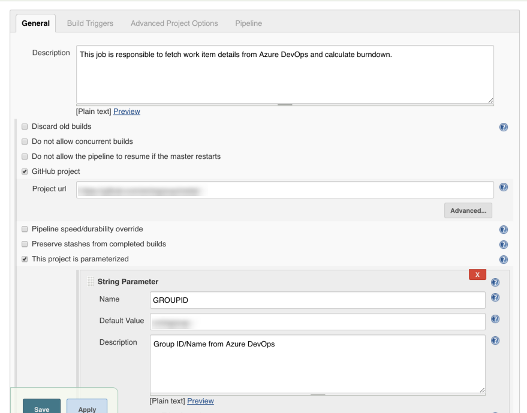
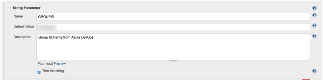
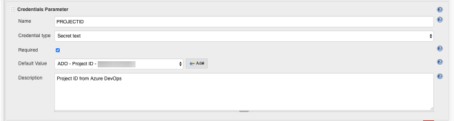
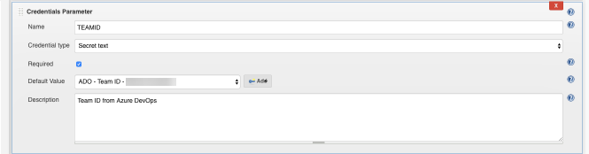
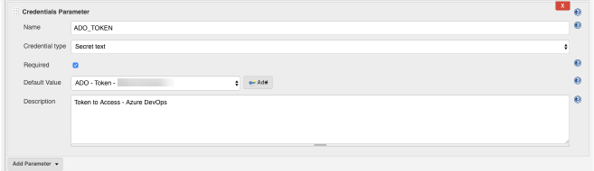
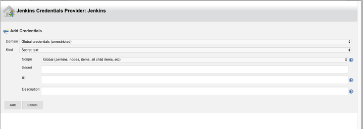

[](http://hits.dwyl.io/donofden/ado-project-burndown-slack)

# ado-project-burndown-slack
CLI script to retrieving data from Azure DevOps

This script will fetch the current iternation of a given team and get the workitems to calculate the story points availabe in the columns. This can be used to know the burndown of a team in a daily basis.

## Configuration

You will need the update the variables in Makefile:

```
ADO_GROUPID
ADO_PROJECTID
ADO_TEAMID
ADO_TOKEN
```
Kindly check the document of [Azure Devops API](https://docs.microsoft.com/en-us/rest/api/azure/devops/?view=azure-devops-rest-5.0) to get the **ADO_GROUPID**,
**ADO_PROJECTID**, **ADO_TEAMID**.

ADO_GROUPID - The name of the Azure DevOps organization

ADO_PROJECTID - Project ID or project name

ADO_TEAMID - Team ID or team name

Refer here to get [ADO_PROJECTID](https://docs.microsoft.com/en-us/rest/api/azure/devops/core/projects/get?view=azure-devops-rest-5.0)

[Check here for more information, on how to get the above details](https://docs.microsoft.com/en-us/rest/api/azure/devops/work/boards/list?view=azure-devops-rest-5.0)

To generate **ADO_TOKEN** [Follow the link here](https://docs.microsoft.com/en-us/azure/devops/organizations/accounts/use-personal-access-tokens-to-authenticate?view=azure-devops)

The arguments can be passed via the Makefile:
```
Calculate burn down for the Day from Azure DevOps

optional arguments:
  -h, --help            show this help message and exit
  -g GROUPID, --groupid GROUPID
                        Group Id from Azure DevOps Board
  -p PROJECTID, --projectid PROJECTID
                        Project Id from Azure DevOps Board
  -t TEAMID, --teamid TEAMID
                        Team Id from Azure DevOps Board
  -a TOKEN, --token TOKEN
                        Authorization Token to Azure DevOps Board
```


## Integrating with Slack & Jenkins

This script can be run via Jenkins and Post result to the slack channel, to reduce the time to check it manaually and the rest of the team can view the burndown daily. An agile team can use it as they are self-organizing team.

Create a Pipeline Project in Jenkins with the following configurations:



Since we need to pass the ID we need to create add this credentials in Jenkins si it can be passed dynamically.

`This project is parameterized` - we are going to create one `String Parameter` & three `Credentials Parameter`.






We are using `Jenkins Credentials Provider: Jenkins` to secure our Token and ID's generated from ADO.



To run `Pipeline` we use `Pipeline script`

```
node('linux') {
    def date = new Date()
    String datePart = date.format("dd-MM-yyyy")
    String timePart = date.format("HH:mm")
    
    withCredentials([
        string(credentialsId: 'JENKINS_CREDENTIALS_PROVIDER_ID_PROJECTID', variable: 'P1'),
        string(credentialsId: 'JENKINS_CREDENTIALS_PROVIDER_ID_TEAMID', variable: 'P2'),
        string(credentialsId: 'JENKINS_CREDENTIALS_PROVIDER_ID_ADO_TOKEN', variable: 'P3'),
    ]) {
            git([url: 'git@github.com:ado-project-burndown-slack.git', branch: 'master'])
            def getResult
            
            
            stage ('Execute Script') {
              getResult = sh(
                script: "python daily-burn-down.py -g "+GROUPID+" -p "+'${P1}'+" -t "+'${P2}'+" -a "+'${P3}'+"",
                returnStdout: true,
              )
            }
            stage ('Send Slack Notification') {
              slackSend channel: '#your-slack-channel-name', color: 'good', message: '```' +getResult+ '``` Burndown '+datePart+'  '+timePart+' :white_check_mark:'
            }
        }
    }
```

Please note that I haven't covered the integration of `Send Slack Notification` you can [check for more information here..](https://jenkins.io/doc/pipeline/steps/slack/)


